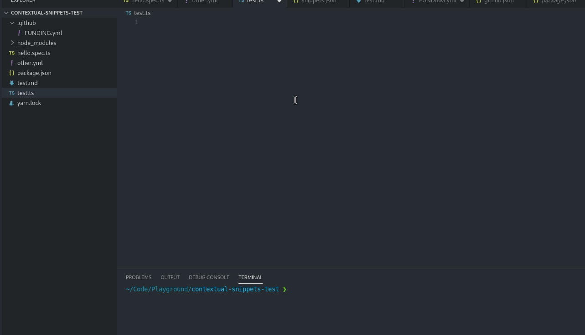

# Contextual Snippets Extension for VS Code

> This extension provides a more advanced way to define Code Snippets in VS Code.

[](https://github.com/brpaz/vscode-contextual-snips)
[](https://codecov.io/gh/brpaz/vscode-contextual-snips)
[](https://marketplace.visualstudio.com/items?itemName=contextual-snips)
[](https://marketplace.visualstudio.com/items?itemName=brpaz.contextual-snips)
[](https://marketplace.visualstudio.com/items?itemName=contextual-snips)
[](LICENSE)

## Demo



## Background

Code snippets is a great way to improve coding speed. A problem that I found on VS Code is that the user have limited control, related to the criteria of display the snippets suggestions. The only filter you can do is by language.

This limitation can result in lots of noise, when we are dealing with many snippets, because the editor will provide snippet suggestions that are not applicable to the current context. 

For example, for YAML files, if I am editing a "GitHub Action" workflow, I don´t want to see snippet suggestions for other YAML files.

Even in the scope of a particular language, if am working on a Javascript application, but I am not using Jest for testing, Jest suggestions would be not useful.

This extension aims to help with these problems, by allowing you to define some more conditions for your snippets.

## Install

To install the extension, open the command pallete and type: `ext install brpaz.contextual-snips`.

## Features

This extension works by extending the default VS Code snnippets format with a extra `context` property. You can use this property to define the rules, that this extension will use to match the snippets.

The following options are available:

* `pattern`: A glob pattern to match with the current file.
* `package`: Allow define that a snippet will only be displayed in a specific package is present in the project. (For now `npm` and `composer` and `gommod` (expiremental) are supported).
* `contentMatch`: A regex that will be matched against the entire text of the current opened file. Use it more more advanced use cases.


## Usage

By default, this extension will look for snippets on the VSCode User Folder.

Depending on your platform, it is located at:

* **Windows** %APPDATA%\Code\User\contextual-snippets
* **macOS** $HOME/Library/Application Support/Code/User/contextual-snippets
* **Linux** $HOME/.config/Code/User/contextual-snippets

You can override this location, by setting the  ```contextual-snips.snippets-path``` in the Settings.

Then you need to create your snippets json files in that location. You can organize everything on a single file or create multiple files. Iy´s up to you and this extension doesn´t care.

The snippet format is similar to the VS Code format, but with the extra `context` field as mentioned.

For Example, to create Jest snippets, only for test files and with the Jest package installed, you could define your script as follows:

```json
{
    "jest-afterall": {
        "body": [
            "afterAll(() => {\n\t$0\n});"
        ],
        "description": "afterAll function is called once after all specs",
        "prefix": [
            "jest afterall",
            "aa"
        ],
        "scope": "javascript,javascriptreact,typescript,typescriptreact",
        "context": {
            "patterns": [
                "**/*/*.spec.{ts,js}"
            ],
            "package": {
                "provider": "npm",
                "name": "jest"
            }
        }
    },
```

A more advanced example, using `contentMatch`. Let´s say you want to enable a particular snippet only to YAML files containing Kubernetes definitions.

You can write your `context` rules as follows:

```json
"context": {
    "patterns": [
    "**/**/*.yml"
    ],
    "contentMatch": "^apiVersion"
},
```

Very basic regex, it will match all files starting with `apiVersion`. You can of course, write a lot more complex regexes.

You can create your JSON files by hand ([Snippet Creator](https://snippet-generator.app/) is very useful to format the snippet correctly), or you can use the `Contextual Snippets: Create from selection` command or Editor context menu, to create a snippet from your current text selection. The extension will then prompt you for the snippet defails.

## Contributing

Contributions are what make the open source community such an amazing place to be learn, inspire, and create. Any contributions you make are **greatly appreciated**.

1. Fork the Project
2. Create your Feature Branch (`git checkout -b feature/AmazingFeature`)
3. Commit your Changes (`git commit -m 'Add some AmazingFeature'`)
4. Push to the Branch (`git push origin feature/AmazingFeature`)
5. Open a Pull Request


## 💛 Support the project

If this project was useful to you in some form, I would be glad to have your support.  It will help to keep the project alive and to have more time to work on Open Source.

The sinplest form of support is to give a ⭐️ to this repo.

You can also contribute with [GitHub Sponsors](https://github.com/sponsors/brpaz).

[](https://github.com/sponsors/brpaz)


Or if you prefer a one time donation to the project, you can simple:

<a href="https://www.buymeacoffee.com/Z1Bu6asGV" target="_blank"></a>

## Author

👤 **Bruno Paz**

* Website: [brunopaz.dev](https://brunopaz.dev)
* Github: [@brpaz](https://github.com/brpaz)
* Twitter: [@brunopaz88](https://twitter.com/brunopaz88)

## License

[MIT](LICENSE)